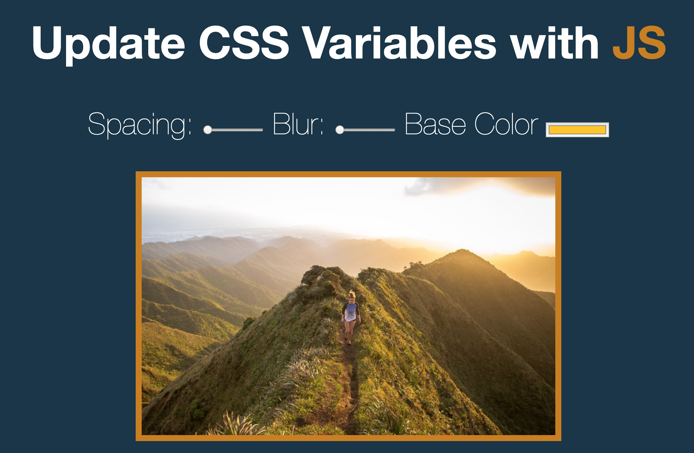

# 09_CSS_Variable_JS30_03

We used **dataset**, **name** and **type** property in HTML.  
        '--valueExample'    **CSS variables** in CSS.  
        document.documentElement.style.**setProperty()** in JS.  

